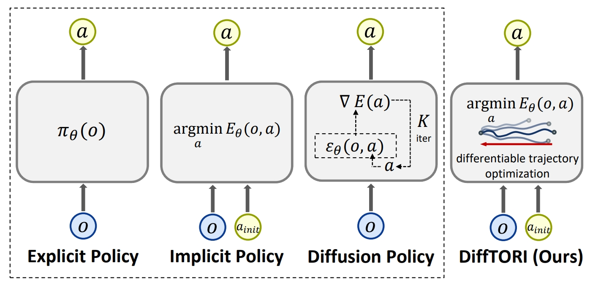

# <a href="https://arxiv.org/abs/2402.05421">DiffTORI: Differentiable Trajectory Optimization for Deep Reinforcement and Imitation Learning </a>


  <a href="https://arxiv.org/abs/2402.05421"><strong>arXiv</strong></a>
  |
  <a href="https://x.com/weikang_wan/status/1866644189523611720"><strong>Twitter</strong></a> 

  <a href="https://wkwan7.github.io/">Weikang Wan*</a>, 
  <a href="https://wadiuvatzy.github.io/">Ziyu Wang*</a>, 
  <a href="https://yufeiwang63.github.io/">Yufei Wang*</a>, 
  <a href="https://zackory.com/">Zackory Erickson</a>, 
  <a href="https://davheld.github.io/">David Held</a>
  
  NeurIPS 2024 (Spotlight)  

This is the original implementation of DiffTORI for imitation learning on Metaworld tasks. 

<div align="center">
  
</div>


# 💻 Installation

See [INSTALL.md](docs/INSTALL.md) for installation instructions. 

# 📚 Data
You could generate demonstrations by yourself using our provided expert policies.  Generated demonstrations are under `$YOUR_REPO_PATH/DiffTORI/data/`.
- Download MetaWorld RL experts from [OneDrive](https://1drv.ms/u/s!Ag5QsBIFtRnTlCo0yPIAx-zTNXPn?e=9pHqgn), unzip it, and put the `expert_ckpt` folder under `$YOUR_REPO_PATH/third_party/BEE/`.

# 🛠️ Usage
Scripts for generating demonstrations, training, and evaluation are all provided in the `scripts/` folder. 

The results are logged by `wandb`, so you need to `wandb login` first to see the results and videos.

For more detailed arguments, please refer to the scripts and the code. We here provide a simple instruction for using the codebase.

1. (Optional) If you want to generate the data by yourself, you do do so by running `gen_demonstration_metaworld.sh`. See the scripts for details. For example:
    ```bash
    bash scripts/gen_demonstration_metaworld.sh sweep
    ```
    This will generate demonstrations for the `sweep` task in Metaworld environment. The data will be saved in `DiffTORI/data/` folder automatically.


2. Train and evaluate a policy using DP3, which will be used as the base policy for DiffToRI. For example:
    ```bash
    bash scripts/train_policy.sh dp3 metaworld_sweep_pointcloud 0 0 0
    ```
    This will train a DP3 policy on the `sweep` task in Metaworld environment using point cloud modality. The checkpoint will be saved in `DiffTORI/data/metawordl_sweep_pointcloud-dp3-0-seed0/checkpoints/`

3. Train and evaluate a policy using DiffTORI, loading a trained DP3 policy as the base policy. For example:
    ```
    bash scripts/train_difftori.sh difftori metaworld_sweep_pointcloud 0 0 0 ep_pointcloud-dp3-0-seed0/checkpoints/epoch-0900-test_mean_score-0.670.ckpt
    ```
    This will train a DiffTORI policy on the `sweep` task in Metaworld environment using point cloud modality with a pre-trained DP3 policy as action initialization.
  
4. Evaluate a saved policy or use it for inference. For example:
    ```bash
    bash scripts/eval_policy.sh dp3 metaworld_sweep_pointcloud 0 0 0
    bash scripts/eval_diffroti.sh difftori metaworld_sweep_pointcloud 0 0 0 DiffTORI/data/metawordl_sweep_pointcloud-dp3-0-seed0/checkpoints/epoch-0900-test_mean_score-0.670.ckpt
    ```
    This will evaluate the saved DP3 and DiffTORI policy you just trained.

# 😺 Acknowledgement
Our code is generally built upon: [DP3](https://3d-diffusion-policy.github.io/), [Diffusion Policy](https://github.com/real-stanford/diffusion_policy), [VRL3](https://github.com/microsoft/VRL3), [MetaWorld](https://github.com/Farama-Foundation/Metaworld), [BEE](https://jity16.github.io/BEE/). We thank all these authors for their nicely open sourced code and their great contributions to the community.

Contact Ziyu Wang at wadiuvatzy2003@gmail.com if you have any questions or suggestions.

# 📝 Citation

If you find our work useful, please consider citing:
```
@misc{wan2024difftoridifferentiabletrajectoryoptimization,
      title={DiffTORI: Differentiable Trajectory Optimization for Deep Reinforcement and Imitation Learning}, 
      author={Weikang Wan and Ziyu Wang and Yufei Wang and Zackory Erickson and David Held},
      year={2024},
      eprint={2402.05421},
      archivePrefix={arXiv},
      primaryClass={cs.LG},
      url={https://arxiv.org/abs/2402.05421}, 
}
```
